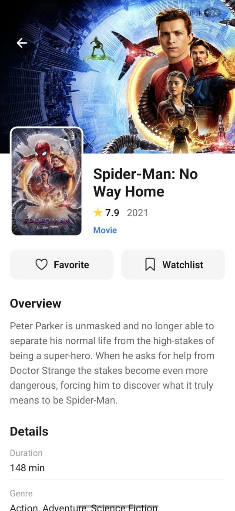
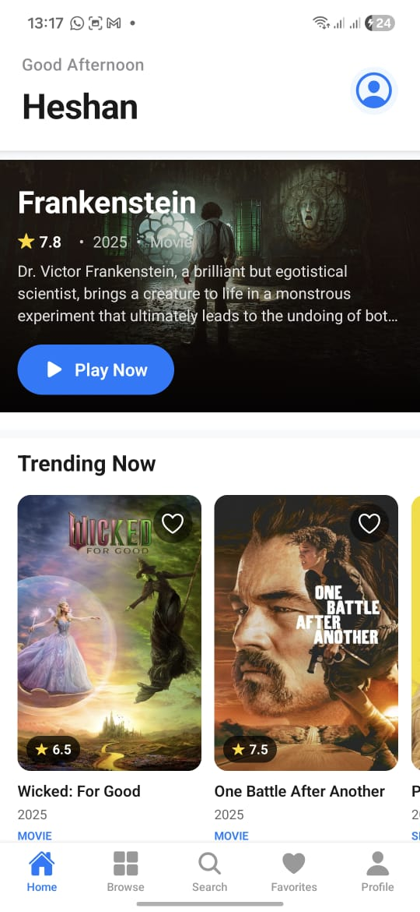
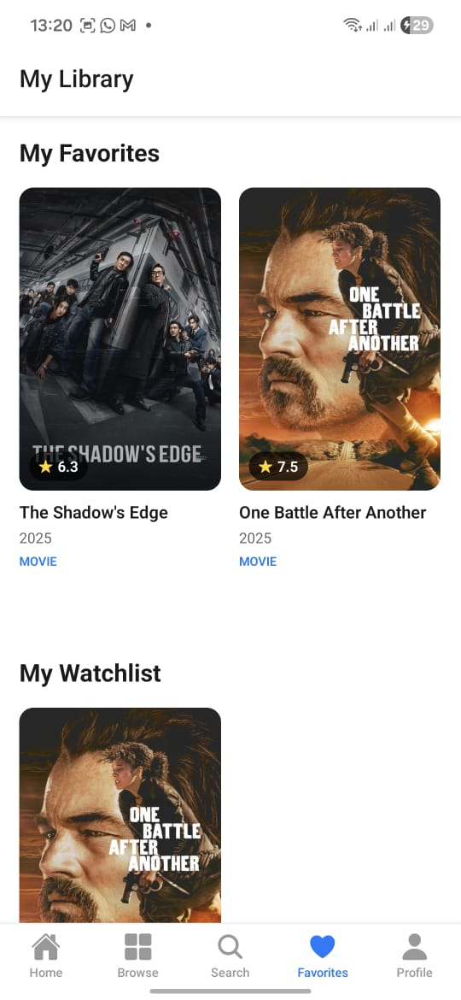

# StreamBox - Entertainment & Media Streaming App

A modern, feature-rich React Native entertainment and media streaming application built with Expo. StreamBox provides a comprehensive media browsing experience with user authentication, favorites management, watchlists, video trailers, and personalized recommendations.


## 📱 Screenshots & Demo

A complete entertainment platform featuring real-time movie/TV show data, trailer playback, user authentication, and personalized content management.

<div align="center">
  
  
  
  
</div>

---

## ✨ Key Features

### 🔐 Authentication System

- **Secure Login/Registration**: Integration with DummyJSON API for authentication
- **Persistent Sessions**: Auto-login with expo-secure-store (encrypted on mobile, localStorage on web)
- **User-Specific Data**: Separate favorites and watchlists per user account
- **Protected Routes**: Authentication-based navigation flow

### 🎬 Media Content & Discovery

- **Real-Time Data**: Integration with The Movie Database (TMDB) API
- **Content Categories**: Movies, TV Series, and Documentaries
- **Featured Content**: Curated featured banner with trending content
- **Search Functionality**: Real-time search with 300ms debouncing across title, description, genre, and cast
- **Advanced Filtering**: Filter by media type (All/Movies/Series/Documentaries)
- **Similar Content**: Recommendations based on viewing patterns

### 🎥 Video Trailer System (Bonus Feature)

- **Real Trailers**: Fetches actual movie/TV show trailers from TMDB API
- **YouTube Integration**: YouTube iframe player for official trailers
- **Fallback Videos**: Demo videos when trailers unavailable
- **Full-Screen Player**: Modal video player with controls
- **Auto-Play**: Trailers automatically start when opened
- **Latest Trailers Section**: Horizontal scrolling carousel of trending trailers

### ❤️ Personalization

- **Favorites Management**: Quick add/remove favorites with visual feedback
- **Watchlist**: Save content to watch later with timestamps
- **User-Specific Storage**: All favorites and watchlists tied to logged-in user
- **Preference Tracking**: Favorite genres and watch history
- **Personalized Recommendations**: Content suggestions based on preferences

### 🎨 Modern UI/UX

- **Clean Design**: Card-based layout with modern aesthetics
- **Gradient Login**: Beautiful gradient background on authentication screens
- **Smooth Animations**: Transitions and loading states
- **Responsive Layout**: Adapts to different screen sizes
- **Icon System**: Expo Vector Icons for consistent iconography
- **Pull-to-Refresh**: Refresh content on all list screens
- **Loading States**: Skeleton screens and indicators

### 📊 User Profile & Statistics

- **Profile Dashboard**: View favorites count, watchlist items, and watch history
- **Personalized Greeting**: Time-based greetings (Good Morning/Afternoon/Evening)
- **User Info Display**: Avatar, username, and account details
- **Logout Functionality**: Secure session termination

---

## 🛠 Tech Stack

### Core Technologies

- **Framework**: React Native 0.81.5 with Expo SDK 54
- **Language**: TypeScript 5.9.2
- **State Management**: Redux Toolkit 2.10.1
- **Persistence**: Redux Persist 6.0.0 with AsyncStorage
- **Navigation**: React Navigation 7.x (Bottom Tabs + Native Stack)

### API & Data

- **Authentication**: DummyJSON API (https://dummyjson.com)
- **Media Data**: The Movie Database (TMDB) API
- **HTTP Client**: Axios 1.13.2
- **Data Storage**: expo-secure-store (mobile) / localStorage (web)

### UI & Media

- **Icons**: @expo/vector-icons 15.0.3
- **Gradients**: expo-linear-gradient 15.0.7
- **Video Playback**: expo-av 16.0.7
- **YouTube Player**: react-native-youtube-iframe 2.4.1
- **WebView**: react-native-webview 13.16.0

### Forms & Validation

- **Form Management**: Formik 2.4.9
- **Schema Validation**: Yup 1.7.1

---

## 🚀 Getting Started

### Prerequisites

- **Node.js**: v20.17.0 or higher
- **npm**: 11.4.1 or higher
- **Expo CLI**: Latest version
- **Expo Go** app (for mobile testing)

### Installation Steps

1. **Clone the repository**

```bash
git clone <repository-url>
cd StreamBox
```

2. **Install dependencies**

```bash
npm install
```

3. **Start the development server**

```bash
npx expo start
```

4. **Run on your preferred platform**
   - **Android**: Press `a` or scan QR with Expo Go
   - **iOS**: Press `i` or scan QR with Expo Go
   - **Web**: Press `w` to open in browser

### Demo Credentials

For testing authentication:

- **Username**: `emilys` or `michaelw`
- **Password**: `emilyspass`

---

## 📁 Project Structure

```
StreamBox/
├── src/
│   ├── api/
│   │   ├── authService.ts           # Authentication API integration
│   │   └── mediaService.ts          # TMDB API integration & media data
│   │
│   ├── components/
│   │   ├── CategoryRow.tsx          # Horizontal/grid media list component
│   │   ├── FeaturedBanner.tsx       # Featured content banner with backdrop
│   │   ├── MediaCard.tsx            # Individual media item card
│   │   ├── SearchBar.tsx            # Search input with debouncing
│   │   └── TrailerCard.tsx          # Trailer card for video previews
│   │
│   ├── navigation/
│   │   └── RootNavigator.tsx        # Main navigation setup (Auth + App)
│   │
│   ├── redux/
│   │   ├── store.ts                 # Redux store with persist config
│   │   └── slices/
│   │       ├── authSlice.ts         # Authentication state & thunks
│   │       ├── favoritesSlice.ts    # User-specific favorites management
│   │       ├── mediaSlice.ts        # Media content & categories state
│   │       ├── searchSlice.ts       # Search query & results state
│   │       └── watchlistSlice.ts    # User-specific watchlist management
│   │
│   ├── screens/
│   │   ├── BrowseScreen.tsx         # Browse with filters
│   │   ├── FavoritesScreen.tsx      # Favorites & watchlist view
│   │   ├── HomeScreen.tsx           # Main feed with trailers
│   │   ├── LoginScreen.tsx          # Authentication login screen
│   │   ├── MediaDetailScreen.tsx    # Media details with similar content
│   │   ├── ProfileScreen.tsx        # User profile & logout
│   │   ├── RegisterScreen.tsx       # User registration screen
│   │   ├── SearchScreen.tsx         # Search interface
│   │   └── VideoPlayerScreen.tsx    # Trailer video player
│   │
│   └── types/
│       └── media.ts                 # TypeScript interfaces & types
│
├── assets/                          # Images, fonts, icons
├── app.json                         # Expo configuration
├── package.json                     # Dependencies
├── tsconfig.json                    # TypeScript configuration
└── README.md                        # This file
```

---

## 📱 Application Screens

### 1. 🔐 Authentication Screens

#### Login Screen

- Modern gradient blue background
- Username and password inputs with validation
- Demo credentials display
- "Remember me" functionality via secure storage
- Navigation to registration

#### Register Screen

- User registration form (mock implementation)
- Form validation with Formik & Yup
- Automatic login after registration

### 2. 🏠 Home Screen

- **Welcome Header**: Personalized greeting with user's name and avatar
- **Featured Banner**: Large backdrop with play button for trending content
- **Trending Now**: Horizontal scrolling row of popular content
- **Latest Trailers**: Video trailer carousel (Bonus Feature)
- **Popular Movies**: Curated movie recommendations
- **Top Series**: TV show recommendations
- **Pull-to-Refresh**: Swipe down to reload content

### 3. 🔍 Browse Screen

- **Filter Tabs**: All, Movies, Series, Documentaries
- **Grid Layout**: 2-column responsive grid
- **Quick Actions**: Add to favorites directly from grid
- **Empty States**: Clear messaging when no content

### 4. 🔎 Search Screen

- **Real-Time Search**: Debounced search (300ms delay)
- **Search Scope**: Title, description, genre, cast
- **Results Grid**: Matching content in 2-column layout
- **Empty State**: "No results" messaging
- **Clear Button**: Quick search reset

### 5. ❤️ Favorites Screen

- **My Favorites**: Grid of favorited content
- **My Watchlist**: Separate watchlist section
- **User-Specific**: Only shows current user's items
- **Quick Navigation**: Tap to view details
- **Empty State**: Prompts to add favorites

### 6. 👤 Profile Screen

- **User Info**: Avatar, username, email
- **Statistics**: Favorites count, watchlist count
- **Greeting**: Time-based personalized message
- **Logout**: Secure session termination

### 7. 📄 Media Detail Screen

- **Full Media Info**: Title, rating, release year, description
- **Cast & Crew**: Actor names with roles
- **Action Buttons**: Add to favorites/watchlist
- **Similar Content**: Recommendations based on genre
- **Large Visuals**: Backdrop and poster images

### 8. 🎥 Video Player Screen (Bonus)

- **YouTube Integration**: Plays real trailers from TMDB
- **Fallback Videos**: Demo videos when trailers unavailable
- **Play Controls**: Play/pause, mute/unmute
- **Full Information**: Title, rating, description below player
- **Close Button**: Easy navigation back

---

## 🔄 State Management Architecture

### Redux Slices Overview

#### 1. **authSlice** - Authentication State

```typescript
State: {
  user: AuthResponse | null;
  token: string | null;
  isAuthenticated: boolean;
  isLoading: boolean;
  error: string | null;
}

Actions: -loginUser(credentials) -
  registerUser(data) -
  loadStoredAuth() -
  logoutUser() -
  clearError();
```

#### 2. **mediaSlice** - Media Content

```typescript
State: {
  allMedia: Media[]
  featuredMedia: Media[]
  trendingMedia: Media[]
  moviesList: Media[]
  seriesList: Media[]
  documentariesList: Media[]
  loading: boolean
  error: string | null
}

Actions:
- fetchAllMedia()
- fetchFeaturedMedia()
- fetchTrendingMedia()
- fetchMovies()
- fetchSeries()
- fetchTrailersForMedia() // Bonus Feature
```

#### 3. **favoritesSlice** - User Favorites

```typescript
State: {
  byUser: { [userId: string]: string[] }
  currentUserId: string | null
}

Actions:
- toggleFavorite(mediaId)
- setCurrentUser(userId)
- clearFavorites()

Selectors:
- selectCurrentUserFavorites
```

#### 4. **watchlistSlice** - Watchlist Management

```typescript
State: {
  byUser: { [userId: string]: WatchlistItem[] }
  currentUserId: string | null
}

Actions:
- toggleWatchlist(item)
- setCurrentUser(userId)
- clearWatchlist()

Selectors:
- selectCurrentUserWatchlist
```

#### 5. **searchSlice** - Search Functionality

```typescript
State: {
  query: string
  results: Media[]
  loading: boolean
  error: string | null
}

Actions:
- searchMedia(query)
- setQuery(text)
- clearSearch()
```

### Data Persistence Strategy

**Persisted Data** (via Redux Persist):

- ✅ Authentication state (token, user)
- ✅ User-specific favorites
- ✅ User-specific watchlists
- ✅ User preferences

**Non-Persisted Data** (fetched fresh):

- ❌ Media content lists
- ❌ Search results
- ❌ Featured/trending content

---

## 🎨 UI/UX Design Patterns

### Color Scheme

- **Primary**: #007AFF (iOS Blue)
- **Background**: #F8F9FA (Light Gray)
- **Cards**: #FFFFFF (White)
- **Text Primary**: #1A1A1A
- **Text Secondary**: #8E8E93
- **Error**: #FF3B30
- **Success**: #34C759
- **Warning**: #FFD700

### Component Design

- **Card-based Layout**: Clean white cards with 8px spacing
- **Shadow & Elevation**: Subtle shadows for depth
- **Border Radius**: 12-16px for modern look
- **Typography**: System fonts with clear hierarchy
- **Iconography**: Consistent Ionicons usage

### Animations & Interactions

- **Pull-to-Refresh**: Native feel on content lists
- **Touch Feedback**: Active opacity on buttons (0.8)
- **Loading States**: Smooth activity indicators
- **Modal Transitions**: Slide from bottom for video player
- **Gradient Overlays**: Enhanced visual appeal on images

---

## 🔌 API Integration

### TMDB API (The Movie Database)

- **Endpoint**: https://api.themoviedb.org/3
- **Features Used**:
  - Movie/TV discovery
  - Trending content
  - Search functionality
  - Video trailers
  - Similar recommendations
  - Genre listings
  - Cast & crew information

### DummyJSON API

- **Endpoint**: https://dummyjson.com
- **Features Used**:
  - User authentication
  - Login endpoint
  - Mock user data

### API Service Functions

```typescript
// mediaService.ts
-getAllMedia() -
  getFeaturedMedia() -
  getTrendingMedia() -
  getMediaByType(type) -
  getMediaById(id) -
  searchMedia(query) -
  getTrailerUrl(id, type) - // Bonus Feature
  getSimilarMedia(id, type) -
  // authService.ts
  login(credentials) -
  register(data) -
  getCurrentUser(token);
```

---

## ✅ Form Validation

### Review Form (Formik + Yup)

```typescript
const ReviewSchema = Yup.object().shape({
  rating: Yup.number()
    .min(1, "Rating must be at least 1")
    .max(10, "Rating cannot exceed 10")
    .required("Rating is required"),
  comment: Yup.string()
    .min(10, "Review must be at least 10 characters")
    .max(500, "Review cannot exceed 500 characters")
    .required("Review is required"),
});
```

### Login Form

```typescript
const LoginSchema = Yup.object().shape({
  username: Yup.string()
    .min(3, "Username must be at least 3 characters")
    .required("Username is required"),
  password: Yup.string()
    .min(6, "Password must be at least 6 characters")
    .required("Password is required"),
});
```

---

## 🗺 Navigation Flow

```
App Root
└─┬─ Authenticated?
  ├─ NO → Auth Stack
  │   ├─ Login Screen
  │   └─ Register Screen
  │
  └─ YES → Main Stack
      ├─ Tab Navigator (Main)
      │   ├─ Home Tab
      │   ├─ Browse Tab
      │   ├─ Search Tab
      │   ├─ Favorites Tab
      │   └─ Profile Tab
      │
      ├─ MediaDetail Screen (Modal)
      └─ VideoPlayer Screen (Modal) // Bonus Feature
```

---

## 📦 Complete Dependencies

```json
{
  "dependencies": {
    "@expo/vector-icons": "^15.0.3",
    "@react-native-async-storage/async-storage": "2.2.0",
    "@react-navigation/bottom-tabs": "^7.8.6",
    "@react-navigation/elements": "^2.6.3",
    "@react-navigation/native": "^7.1.21",
    "@react-navigation/native-stack": "^7.7.0",
    "@reduxjs/toolkit": "^2.10.1",
    "axios": "^1.13.2",
    "expo": "~54.0.25",
    "expo-av": "^16.0.7",
    "expo-constants": "~18.0.10",
    "expo-font": "~14.0.9",
    "expo-haptics": "~15.0.7",
    "expo-image": "~3.0.10",
    "expo-linear-gradient": "~15.0.7",
    "expo-linking": "~8.0.9",
    "expo-router": "~6.0.15",
    "expo-secure-store": "^15.0.7",
    "expo-splash-screen": "~31.0.11",
    "expo-status-bar": "~3.0.8",
    "expo-symbols": "~1.0.7",
    "expo-system-ui": "~6.0.8",
    "expo-web-browser": "~15.0.9",
    "formik": "^2.4.9",
    "react": "19.1.0",
    "react-dom": "19.1.0",
    "react-native": "0.81.5",
    "react-native-gesture-handler": "~2.28.0",
    "react-native-reanimated": "~4.1.1",
    "react-native-safe-area-context": "~5.6.0",
    "react-native-screens": "~4.16.0",
    "react-native-web": "~0.21.0",
    "react-native-webview": "^13.16.0",
    "react-native-worklets": "0.5.1",
    "react-native-youtube-iframe": "^2.4.1",
    "react-redux": "^9.2.0",
    "redux-persist": "^6.0.0",
    "yup": "^1.7.1"
  },
  "devDependencies": {
    "@types/react": "~19.1.0",
    "eslint": "^9.25.0",
    "eslint-config-expo": "~10.0.0",
    "typescript": "~5.9.2"
  }
}
```

---

## 🎯 Assignment Requirements Checklist

### Core Requirements

- ✅ **Topic**: Entertainment & Media Streaming
- ✅ **State Management**: Redux Toolkit with 5 slices
- ✅ **Data Persistence**: Redux Persist with AsyncStorage
- ✅ **Navigation**: React Navigation (Tab + Stack navigators)
- ✅ **Form Validation**: Formik + Yup (Login, Register, Reviews)
- ✅ **API Integration**: TMDB API + DummyJSON API
- ✅ **TypeScript**: 100% TypeScript implementation
- ✅ **Multiple Screens**: 8 screens (6 tabs + 2 modals)
- ✅ **Custom Components**: 7 reusable components

### Bonus Features (5 Marks)

- ✅ **Video Trailer System**: Real trailer playback with TMDB integration
  - YouTube iframe player integration
  - Real trailer fetching from TMDB API
  - Latest Trailers section on Home screen
  - Full-screen video player modal
  - Auto-play functionality
  - Fallback to demo videos

### Additional Features Implemented

- ✅ **User Authentication**: Secure login/register with DummyJSON
- ✅ **User-Specific Data**: Separate favorites/watchlists per user
- ✅ **Secure Storage**: expo-secure-store for tokens
- ✅ **Modern UI**: Gradient backgrounds, card layouts, smooth animations
- ✅ **Pull-to-Refresh**: All list screens
- ✅ **Real-Time Search**: Debounced search with instant results
- ✅ **Advanced Filtering**: Multi-category content filtering
- ✅ **Similar Content**: Personalized recommendations

---

## 🚀 Performance Optimizations

- **Debounced Search**: 300ms delay prevents excessive API calls
- **Redux Memoization**: Efficient selector patterns
- **Image Optimization**: Proper image sizing from TMDB CDN
- **Lazy Loading**: Content loaded on-demand
- **Persistent State**: Redux Persist for instant app startup
- **Optimized Re-renders**: React.memo and useCallback usage

---

## 🐛 Known Limitations

1. **Mock Registration**: User registration uses mock implementation (no real backend)
2. **Demo Videos**: Fallback videos when TMDB trailers unavailable
3. **Offline Mode**: Limited offline functionality (requires network for content)
4. **Search Scope**: Search limited to loaded content

---

## 🔮 Future Enhancements

- [ ] Real backend for user management
- [ ] Offline content download
- [ ] Push notifications for new content
- [ ] Social features (share, comments)
- [ ] Multi-language support
- [ ] Dark mode theme
- [ ] Content filtering by rating/year
- [ ] Advanced recommendation algorithm

---

## 📄 License

MIT License - See LICENSE file for details

---

## 👨‍💻 Development

### Running Tests

```bash
npm test
```

### Linting

```bash
npm run lint
```

### Building for Production

```bash
# Android
npx expo build:android

# iOS
npx expo build:ios

# Web
npx expo build:web
```

---

## 📞 Support & Contact

For issues or questions, please open an issue on the GitHub repository.

---

**Built with ❤️ using React Native, Expo, Redux Toolkit, and TMDB API**

_StreamBox - Your Ultimate Entertainment Companion_ 🎬🍿
